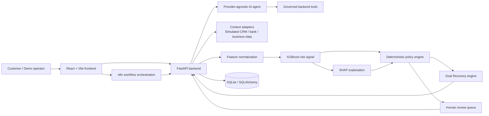

# FinMate Architecture

## Architecture intent

FinMate separates conversational assistance from governed financial decisions. The LLM coordinates the journey and communicates with the user; deterministic policy, not the LLM, owns the final governed outcome.

## Components

### Frontend — React + Vite

- Capture goal, requested amount, and simulated customer context.
- Display journey status, missing requirements, governed reasons, recovery options, and review handoff.
- Never calculate risk, final decisions, or recovery eligibility in the browser.

### FastAPI backend

- Owns API contracts, validation, journey state, tool endpoints, adapters, policy execution, persistence, and audit records.
- Exposes versioned endpoints such as `/api/v1/journeys`, `/score`, `/policy/evaluate`, `/recovery/options`, and `/reviews`.
- Keeps agent-facing tools narrow, validated, and idempotent where possible.

### AI agent

- Understands goals, asks clarifying questions, chooses allowed tools, and communicates the governed results.
- Uses an LLM provider interface so providers can be swapped.
- Cannot write a final approval/rejection, override policy, fabricate risk signals, or call external systems directly.

### n8n workflow orchestration

- Coordinates notifications, pending-document reminders, review handoffs, and asynchronous demo steps.
- Calls documented FastAPI endpoints; it must not contain a competing policy implementation.
- Uses replaceable webhook and credential adapters.

### Context gathering

- Adapter interfaces provide simulated customer, business, CRM, and bank context.
- Normalize only data required for a declared decision input.
- Store source, retrieval time, simulation status, and correlation ID with gathered context.

### XGBoost risk model and SHAP

- XGBoost accepts an explicit versioned feature schema and returns a risk/eligibility signal.
- SHAP is generated from that exact model version and the exact normalized input used for scoring.
- Neither component returns an approval or rejection.

### Policy engine

- Inputs: risk signal, model metadata, SHAP factors where needed for explanation, verified context, and configured policy rules.
- Output: deterministic governed status, triggered rule IDs, missing requirements, permitted next actions, and policy version.
- Rules live in versioned configuration/code and must be unit-tested independently of the LLM.

### Goal Recovery engine

- Inputs: underlying goal, requested product/amount, policy result, and allowed recovery rules.
- Output: legitimate alternatives such as right-sized financing, phased financing, or eligibility improvement and reapplication.
- It never invents an offer, bypasses policy, or represents a recovery path as a production commitment.

### Human review

- Receives high-impact, exceptional, conflicting, or ambiguous cases.
- Stores a concise evidence package: goal, gathered context references, score metadata, policy outcome, explanations, recovery options, and agent transcript summary.
- A human resolution is recorded separately from automated policy output.

### Database — SQLite / SQLAlchemy

Initial entities should include `journeys`, `goals`, `context_snapshots`, `feature_snapshots`, `model_scores`, `policy_evaluations`, `recovery_options`, `agent_messages`, and `review_cases`.

Persist immutable versions and timestamps for model, policy, recovery rules, and simulation sources. Do not persist personal/private financial data in the prototype.

## API boundaries

- Frontend and n8n call FastAPI; neither calls model internals directly.
- The AI agent accesses governed FastAPI tool endpoints, not database tables or external integrations directly.
- The model service accepts normalized features only and returns signal plus metadata.
- The policy engine is invoked server-side only.
- External systems are behind adapters and must declare whether results are simulated.

## Decision responsibility matrix

| Decision/activity | Responsible component |
|---|---|
| Understand goal, ask questions, explain result | AI agent |
| Gather permitted context | FastAPI adapters / workflow |
| Risk or eligibility signal | XGBoost |
| Feature-attribution explanation | SHAP using scored model |
| Final governed outcome | Deterministic policy engine |
| Alternative permissible journey paths | Goal Recovery engine constrained by policy |
| Exceptional or ambiguous resolution | Human reviewer |
| UI rendering and customer selection | Frontend |

## Data flow

1. Frontend creates a journey and goal through FastAPI.
2. Agent requests permitted context through backend tools.
3. Backend normalizes and validates the versioned feature payload.
4. XGBoost scores the payload; SHAP explains that same score.
5. Policy evaluates inputs and persists a deterministic outcome.
6. If the original path is unsuitable, Goal Recovery returns policy-permitted alternatives.
7. Agent communicates the result, or n8n creates a follow-up/review workflow.
8. Every step writes an auditable record tied to the journey ID.

## Security and governance

- Use validation, least-privilege service boundaries, correlation IDs, and structured audit logs.
- Treat all integration data as simulated until a real adapter is explicitly implemented and approved.
- Keep provider credentials outside source control and keep providers replaceable.
- Do not send raw datasets or unnecessary financial context to an LLM.
- Enforce model/policy/recovery versioning and reproducible feature transformations.
- Require human escalation for defined high-impact or ambiguous states.
