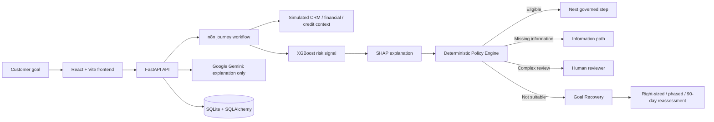

# FinMate

> **Your AI teammate for financial journeys.**

FinMate is a hackathon prototype for governed financial journeys. It starts with what a customer is trying to achieve—not just a requested amount—and uses explainable machine learning plus deterministic policy controls to guide the next step.

When a requested path is not suitable, FinMate does not simply stop the experience. Its core differentiator, **Goal Recovery**, identifies permitted prototype alternatives that may still move the customer toward the same goal.

> **Prototype disclaimer:** FinMate uses simulated customer, financial, and credit data. It is not a production lending system, credit decision service, product offer, or guarantee of any financial outcome.

## The problem

Traditional eligibility experiences reduce a customer journey to a binary result: approved or declined. That leaves customers without a clear, responsible way to continue when their original request is unsuitable.

## The solution

FinMate combines goal understanding, simulated context, an XGBoost risk signal, SHAP explanations, and a deterministic Policy Engine. The result is one governed journey outcome:

- **Eligible** — continue to the next governed step.
- **Missing information** — request the specific required information.
- **Complex human review** — route an exceptional or ambiguous case to a reviewer.
- **Not suitable** — activate Goal Recovery when configured policy permits it.

## Why FinMate is different: Goal Recovery

Goal Recovery preserves the original customer goal while keeping policy controls authoritative. For a `NOT_SUITABLE` result, FinMate can present only configured prototype paths:

- **Right-sized financing** — reassess a lower amount for the same goal.
- **Phased financing** — assess a smaller first phase, with later phases evaluated separately.
- **Improve eligibility** — a 90-day preparation plan followed by a new governed reassessment.

These are neither approvals nor offers. They do not override the original decision, change a policy rule, or promise an outcome.

## Key features

- Customer financial-journey creation and goal capture
- Simulated CRM, financial, and credit context
- XGBoost prototype risk assessment
- SHAP-based risk and protective-factor explanations
- Deterministic, versioned Policy Engine
- Missing-information and complex human-review paths
- Governed Goal Recovery after eligible `NOT_SUITABLE` outcomes
- Right-sized and phased-financing recovery paths
- 90-day improve-eligibility plan and reassessment flow
- Gemini-powered, validation-gated recovery explanations with a deterministic fallback
- Journey audit context and simulated verification updates
- React UI for journey, recovery, intelligence, audit, and history views

## Example customer journey

**Goal:** Purchase inventory<br>
**Requested amount:** **₹2,00,000**

1. The customer submits an inventory goal and requested amount.
2. n8n retrieves the customer’s simulated CRM, financial, and credit context.
3. XGBoost produces a prototype risk signal; SHAP explains the influential factors.
4. The deterministic Policy Engine returns `NOT_SUITABLE` for the original path.
5. Goal Recovery keeps the inventory goal intact and may present:
   - a smaller amount for a new governed evaluation,
   - a phase-one financing route, or
   - a 90-day eligibility-improvement plan followed by reassessment.

Every reassessment is a new governed evaluation. Completing a recovery plan does not determine the result.

## System architecture



## AI/ML architecture

FinMate deliberately separates assistance from decisioning.

| Responsibility | Component |
| --- | --- |
| Goal understanding, communication, optional recovery copy | Google Gemini |
| Orchestration of the primary journey | n8n |
| Prototype risk signal | XGBoost |
| Feature-attribution explanation | SHAP |
| Governed outcome | Deterministic Policy Engine |
| Recovery alternatives | Deterministic Goal Recovery Engine |
| Exceptional or ambiguous cases | Human reviewer |

The LLM cannot approve or reject an application, alter a risk score, modify a recovery path or amount, override review, invent customer data, or promise approval. Gemini recovery output is schema-validated and must explain only the already-authoritative deterministic paths; provider or validation failures fall back safely to the deterministic UI.

## Governance and human-in-the-loop

- Policy rules have explicit precedence for missing information, ambiguity, unsuitable risk, review thresholds, and eligible journeys.
- Goal Recovery only runs after a governed `NOT_SUITABLE` result and only for configured recovery rules.
- Complex or exceptional cases retain their human-review requirement; automated recovery is not generated for them.
- The UI clearly labels data and outcomes as simulated/prototype and preserves audit metadata, policy versions, and triggered rule IDs.
- No real Paytm, bank, credit bureau, CRM, or loan-provider integration is implemented.

## Technology stack

- **Frontend:** React 18, Vite, TypeScript, React Router
- **Backend:** Python, FastAPI, Pydantic, SQLAlchemy
- **Data:** SQLite
- **ML/explainability:** XGBoost, scikit-learn, SHAP, pandas, joblib
- **AI:** Google Gemini via `google-genai`
- **Orchestration:** n8n webhook workflow and REST APIs
- **Deployment targets:** Vercel (frontend), Render (backend), n8n Cloud (workflow)
- **Source control:** Git and GitHub

Cognee is a planned contextual-memory/retrieval integration. It is not currently a checked-in runtime dependency or configured service in this repository; present customer context is simulated and persisted through the existing backend/SQLite flow. Sarvam AI is also planned and is **not** currently integrated.

## Project structure

```text
Finmate/
├── app/
│   ├── api/v1/endpoints/       # FastAPI journey, risk, policy, recovery, and context routes
│   ├── context/                # Simulated demo context and seeding
│   ├── ml/                     # Training, preprocessing, inference, and SHAP helpers
│   ├── policy/                 # Deterministic policy configuration and service
│   ├── recovery/               # Deterministic Goal Recovery rules and service
│   ├── schemas/                # API and governed-output contracts
│   ├── services/               # Gemini assistant and recovery personalization
│   ├── config.py
│   ├── database.py
│   └── main.py
├── artifacts/ml/               # Saved model, preprocessing artifacts, and metadata
├── docs/n8n.md                 # n8n import and configuration guide
├── frontend/
│   └── src/                    # React pages, components, API client, types, and tests
├── scripts/
│   ├── seed_demo_customers.py
│   └── train_risk_model.py
├── tests/                      # Backend, orchestration, policy, ML, and recovery tests
├── workflows/finmate_journey.json
├── .env.example
└── requirements.txt
```

## How the system works

1. The React UI submits `journey_id`, `customer_id`, customer goal, and requested amount to `POST /api/v1/journeys`.
2. FastAPI validates and forwards the journey request to the configured n8n webhook.
3. n8n retrieves simulated context and calls the backend risk, policy, and (when applicable) recovery endpoints.
4. XGBoost returns a prototype risk probability/class and SHAP factors for the scored input.
5. The deterministic Policy Engine selects one governed outcome.
6. If that outcome is `NOT_SUITABLE`, the Goal Recovery Engine may return configured alternatives for the same goal.
7. The frontend renders the returned governed result. Gemini may add optional explanation only; it never changes it.

## Local setup and installation

### Prerequisites

- Python 3.10+ recommended
- Node.js 18+ and npm
- An n8n instance for the full journey flow (local or Cloud)

### Backend

```powershell
python -m venv .venv
.\.venv\Scripts\Activate.ps1
pip install -r requirements.txt
Copy-Item .env.example .env
uvicorn app.main:app --reload
```

The API starts at `http://127.0.0.1:8000`; interactive documentation is available at `http://127.0.0.1:8000/docs`.

### Frontend

```powershell
cd frontend
Copy-Item .env.example .env
npm install
npm run dev
```

Vite serves the UI at `http://127.0.0.1:5173` by default.

## Environment variables

Copy `.env.example` to `.env` for the backend. The checked-in defaults are suitable for local prototype development.

| Variable | Purpose |
| --- | --- |
| `APP_NAME` | FastAPI application name |
| `ENVIRONMENT` | Runtime environment label |
| `DATABASE_URL` | SQLite connection string, default `sqlite:///./finmate.db` |
| `API_V1_PREFIX` | API prefix, default `/api/v1` |
| `N8N_JOURNEY_WEBHOOK_URL` | n8n webhook called by `POST /api/v1/journeys` |
| `N8N_REQUEST_TIMEOUT_SECONDS` | Timeout for the n8n webhook request |
| `CORS_ORIGINS` | Comma-separated permitted frontend origins |
| `GEMINI_API_KEY` | Optional Gemini key; recovery personalization falls back safely if absent/failing |
| `GEMINI_MODEL` | Gemini model name |

For the frontend, set `VITE_API_BASE_URL` in `frontend/.env` when the API is not running at `http://127.0.0.1:8000`.

## Running frontend and backend

Start FastAPI first, then the n8n workflow, then Vite. The frontend’s primary journey call requires the configured n8n webhook to be reachable by the backend.

```powershell
# Backend tests
pytest

# Frontend tests and production build
cd frontend
npm test
npm run build
```

## n8n workflow setup

The importable workflow is [`workflows/finmate_journey.json`](workflows/finmate_journey.json). It orchestrates the journey; it does not independently approve, reject, score, calculate SHAP, or create recovery rules.

1. Import the workflow into n8n.
2. Set `FINMATE_API_URL` in the n8n environment to a publicly reachable FastAPI base URL, without a trailing slash.
3. Verify `GET {FINMATE_API_URL}/api/v1/health` from n8n’s network.
4. Activate the webhook and set its URL as `N8N_JOURNEY_WEBHOOK_URL` in the backend environment.

For n8n Cloud, `localhost` does not refer to your development machine. Use a safely exposed HTTPS demo endpoint or a deployed backend. See [docs/n8n.md](docs/n8n.md) for the workflow node flow and prototype boundary.

## ML model information

The saved prototype artifacts live in `artifacts/ml/`:

- `model.joblib` — XGBoost risk model
- `preprocessing.joblib` — fitted feature preprocessing
- `feature_metadata.json` and `metadata.json` — feature/model metadata
- `shap_importance.json` and `shap_global_importance.json` — SHAP importance data

Run the existing training script when you intentionally want to regenerate prototype artifacts:

```powershell
python scripts/train_risk_model.py
```

The model emits a **risk signal only**. It is not a lending approval or rejection system.

## API overview

All versioned routes are under `/api/v1`.

| Route | Purpose |
| --- | --- |
| `GET /health` | Health check |
| `POST /journeys` | Forward a customer journey to the configured n8n workflow |
| `POST /journeys/reassess` | Run a new governed reassessment using a recovery selection |
| `PATCH /journeys/simulated-verifications` | Update simulated verification state |
| `GET /simulated-context/{customer_id}/{crm\|financial\|credit}` | Retrieve simulated context |
| `POST /risk/infer` | Return prototype XGBoost risk signal and SHAP factors |
| `POST /policy/evaluate` | Return deterministic policy result |
| `POST /recovery/evaluate` | Return deterministic Goal Recovery options |
| `POST /recovery/personalize` | Return optional validated Gemini recovery copy/fallback |
| `POST /assistant/chat` | Ask the governed Gemini assistant about current journey evidence |

OpenAPI documentation is generated by FastAPI at `/docs`.

## Deployment

The repository is structured for a Vite frontend on Vercel, a FastAPI backend on Render, and an n8n Cloud workflow. Deployments must provide the same environment variables described above, use a reachable backend URL for n8n, and preserve the prototype/simulated-data boundary.

This repository does not provide production lending deployment, real provider integrations, or production financial-result guarantees.

## Limitations

- Customer, CRM, financial, and credit records are simulated.
- Model outputs, SHAP factors, policy results, and recovery paths are prototype demonstrations.
- No real credit bureau, bank, CRM, Paytm, or lender integration exists.
- No result should be treated as a credit decision, financial recommendation, loan offer, approval, or guarantee.
- SQLite and the included controls are appropriate for a hackathon prototype, not a production financial-services environment.

## Future enhancements

- Approved, consent-based integrations for verified financial and identity data
- Cognee-backed contextual memory and retrieval with explicit data-governance controls
- Sarvam AI evaluation/integration as an additional provider option
- Reviewer workspace, richer case management, and immutable audit storage
- Policy configuration management, monitoring, model evaluation, and bias/fairness review
- Secure production authentication, authorization, encryption, observability, and deployment hardening

## Team / project information

FinMate is a hackathon project exploring a more helpful and governed alternative to binary financial-journey experiences. It demonstrates how AI assistance, explainable ML, deterministic policy, and human oversight can work together—without allowing an LLM to make financial decisions.

---

Built for thoughtful financial journeys, not automated financial promises.
